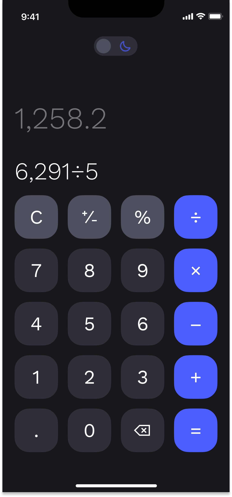

# Calculator App

This is a simple calculator app built using Jetpack Compose, a modern toolkit for building native Android UI. It allows users to perform basic arithmetic calculations such as addition, subtraction, multiplication, and division.

## Features

- **User-Friendly Interface:** Clean and intuitive design for easy navigation and usage.
- **Dark Mode Support:** Seamlessly switch between light and dark themes for comfortable viewing in any lighting condition.
- **Responsive Layout:** Utilizes Jetpack Compose's responsive layout features for consistent display across various screen sizes and orientations.
- **Arithmetic Operations:** Perform standard arithmetic operations including addition, subtraction, multiplication, and division.
- **Clear and Delete Functionality:** Easily clear the input or delete the last entered character.

## Screenshots




## Setup

To run this project locally, follow these steps:

1. **Clone the repository:**

```bash
git clone https://github.com/thisishisham1/Calculator-App.git
